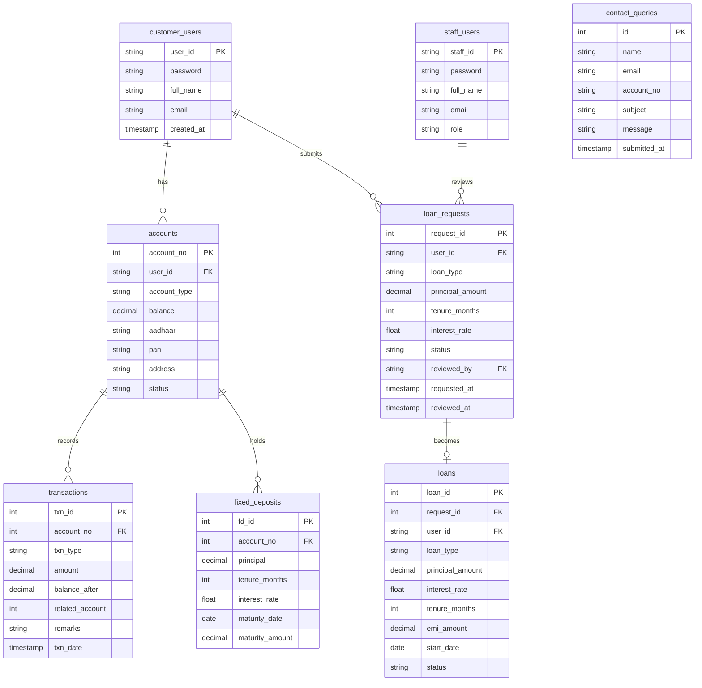

<div align="center">


# 🏦 Smart Bank Management System

> A full-stack web banking application built with **Flask** + **MySQL**, supporting complete customer self-service and staff administration workflows.

[Features](#-features) • [Tech Stack](#-tech-stack) • [Database Schema](#-database-schema) • [ER Diagram](#-er-diagram) • [Getting Started](#-getting-started) • [API Routes](#-api-routes) • [Security](#-security) • [Contributing](#-contributing)

</div>

---

## ✨ Features

### 👤 Customer Portal

| Feature | Description |
|---|---|
| 🏦 **Account Management** | Open savings or current account with Aadhaar & PAN verification |
| 💰 **Deposits & Withdrawals** | Real-time balance updates with full transaction logging |
| 🔄 **Fund Transfers** | Instant transfers to any account with live recipient name lookup |
| 📈 **Fixed Deposits** | Create FDs with auto-calculated 6% p.a. interest & maturity amount |
| 🏠 **Loan Applications** | Apply for Home, Car, Education, or Personal loans with EMI preview |
| 📊 **Transaction History** | 30-day rolling chart + recent transactions table on the dashboard |

### 🛡️ Staff / Admin Portal

| Feature | Description |
|---|---|
| 👥 **Customer Oversight** | View all registered customers; create accounts on their behalf |
| ✅ **Loan Management** | Approve or reject pending loan requests with auto-computed EMI |
| 📋 **Bank-wide Reports** | Full transaction report with one-click CSV export |
| 📁 **Portfolio View** | All active loans and fixed deposits across the entire bank |
| 📊 **Summary Dashboard** | Total accounts, FDs, and aggregate savings at a glance |

### 🔧 General

- 🔐 Role-based authentication (customer vs. staff) with **bcrypt** password hashing
- 🕐 Session management with stale-session detection on every request
- 📬 Contact form with database-persisted support queries
- 🌐 Public landing page and About page

---

## 🛠 Tech Stack

<div align="center">

| Layer | Technology | Purpose |
|---|---|---|
| 🐍 **Backend** | Python 3.8+, Flask | Web framework & routing |
| 🗄️ **Database** | MySQL 8.0 | Relational data storage |
| 🔒 **Auth** | bcrypt | Password hashing |
| 🎨 **Frontend** | Jinja2, HTML, CSS, JS | Templating & UI |
| 📤 **Export** | Python `csv` module | Transaction report downloads |
| 🔌 **DB Driver** | mysql-connector-python | MySQL connectivity |

</div>

---

## 📁 Project Structure

```
sbms/
├── 📄 app.py                   # Main Flask application & all routes
├── 📂 templates/
│   ├── index.html              # Public landing page
│   ├── login.html              # Login (customer + staff toggle)
│   ├── signup.html             # Registration page
│   ├── dashboard.html          # Role-aware main dashboard
│   ├── reports.html            # Staff transaction reports
│   ├── about.html              # About page
│   └── contact.html            # Contact / support form
├── 📂 static/
│   ├── css/                    # Stylesheets
│   ├── js/                     # Client-side scripts
│   └── images/                 # Assets
└── 📄 requirements.txt
```

---

## 🗄️ Database Schema

The system uses **8 MySQL tables** across two user types and five functional domains.

---

### 👤 `customer_users`

Stores all registered customer accounts.

| Column | Type | Constraints | Description |
|---|---|---|---|
| `user_id` | VARCHAR(50) | PRIMARY KEY | Chosen by customer at signup |
| `password` | VARCHAR(255) | NOT NULL | bcrypt hash |
| `full_name` | VARCHAR(100) | NOT NULL | |
| `email` | VARCHAR(100) | | |
| `created_at` | TIMESTAMP | DEFAULT NOW() | Auto-generated |

---

### 🛡️ `staff_users`

Stores bank staff and admin accounts.

| Column | Type | Constraints | Description |
|---|---|---|---|
| `staff_id` | VARCHAR(50) | PRIMARY KEY | Chosen at signup |
| `password` | VARCHAR(255) | NOT NULL | bcrypt hash |
| `full_name` | VARCHAR(100) | NOT NULL | |
| `email` | VARCHAR(100) | | |
| `role` | VARCHAR(50) | | e.g. Manager, Teller |

---

### 🏦 `accounts`

One bank account per customer (enforced at application level).

| Column | Type | Constraints | Description |
|---|---|---|---|
| `account_no` | INT | PRIMARY KEY, AUTO_INCREMENT | Bank account number |
| `user_id` | VARCHAR(50) | FK → `customer_users` | |
| `account_type` | VARCHAR(20) | | Savings / Current |
| `balance` | DECIMAL(15,2) | DEFAULT 0.00 | Current balance |
| `aadhaar` | VARCHAR(12) | | 12-digit, validated server-side |
| `pan` | VARCHAR(10) | | AAAAA9999A format, validated |
| `address` | TEXT | | |
| `status` | VARCHAR(20) | DEFAULT 'Active' | Active / Inactive |

---

### 💸 `transactions`

Every debit, credit, and transfer event is recorded here.

| Column | Type | Constraints | Description |
|---|---|---|---|
| `txn_id` | INT | PRIMARY KEY, AUTO_INCREMENT | |
| `account_no` | INT | FK → `accounts` | |
| `txn_type` | VARCHAR(20) | | Deposit / Withdrawal / Transfer |
| `amount` | DECIMAL(15,2) | | |
| `balance_after` | DECIMAL(15,2) | | Balance snapshot at time of txn |
| `related_account` | INT | | Populated for transfers |
| `remarks` | TEXT | | e.g. "To: 5", "Cash Deposit" |
| `txn_date` | TIMESTAMP | DEFAULT NOW() | Auto-generated |

---

### 📈 `fixed_deposits`

FD records linked to the originating account.

| Column | Type | Constraints | Description |
|---|---|---|---|
| `fd_id` | INT | PRIMARY KEY, AUTO_INCREMENT | |
| `account_no` | INT | FK → `accounts` | |
| `principal` | DECIMAL(15,2) | | Amount locked in FD |
| `tenure_months` | INT | | Duration in months |
| `interest_rate` | FLOAT | DEFAULT 6.0 | Fixed at 6.0% p.a. |
| `maturity_date` | DATE | | Calculated at creation |
| `maturity_amount` | DECIMAL(15,2) | | Principal + simple interest |

> **Interest formula:** `maturity_amount = principal + (principal × 0.06 × tenure / 12)`

---

### 📝 `loan_requests`

Customer loan applications pending staff review.

| Column | Type | Constraints | Description |
|---|---|---|---|
| `request_id` | INT | PRIMARY KEY, AUTO_INCREMENT | |
| `user_id` | VARCHAR(50) | FK → `customer_users` | Applicant |
| `loan_type` | VARCHAR(50) | | Home / Car / Education / Personal |
| `principal_amount` | DECIMAL(15,2) | | Requested amount |
| `tenure_months` | INT | | |
| `interest_rate` | FLOAT | | Set automatically by loan type |
| `status` | VARCHAR(20) | DEFAULT 'Pending' | Pending / Approved / Rejected |
| `reviewed_by` | VARCHAR(50) | FK → `staff_users` | Staff member who acted |
| `requested_at` | TIMESTAMP | DEFAULT NOW() | |
| `reviewed_at` | TIMESTAMP | | Set on approval/rejection |

> **Interest rates by type:** Home 8.0% · Car 9.5% · Education 7.5% · Personal 12.0%

---

### 🏠 `loans`

Active loans created when a request is approved.

| Column | Type | Constraints | Description |
|---|---|---|---|
| `loan_id` | INT | PRIMARY KEY, AUTO_INCREMENT | |
| `request_id` | INT | FK → `loan_requests` | Source request |
| `user_id` | VARCHAR(50) | FK → `customer_users` | |
| `loan_type` | VARCHAR(50) | | |
| `principal_amount` | DECIMAL(15,2) | | |
| `interest_rate` | FLOAT | | |
| `tenure_months` | INT | | |
| `emi_amount` | DECIMAL(15,2) | | Auto-calculated on approval |
| `start_date` | DATE | | Set to CURDATE() on approval |
| `status` | VARCHAR(20) | DEFAULT 'Active' | Active / Closed |

> **EMI formula (reducing balance):**
> ```
> r = annual_rate / 1200
> EMI = P × r × (1+r)^n / ((1+r)^n − 1)
> ```

---

### 📬 `contact_queries`

Support messages submitted via the contact form.

| Column | Type | Constraints | Description |
|---|---|---|---|
| `id` | INT | PRIMARY KEY, AUTO_INCREMENT | |
| `name` | VARCHAR(100) | | |
| `email` | VARCHAR(100) | | |
| `account_no` | VARCHAR(20) | | Optional |
| `subject` | VARCHAR(200) | | |
| `message` | TEXT | | |
| `submitted_at` | TIMESTAMP | DEFAULT NOW() | |

---

## 📊 ER Diagram



---

## 🚀 Getting Started

### Prerequisites

- 🐍 Python 3.8+
- 🗄️ MySQL 8.0+
- 📦 pip

### 1. Clone the Repository

```bash
git clone https://github.com/your-username/sbms.git
cd sbms
```

### 2. Create a Virtual Environment

```bash
python -m venv venv
source venv/bin/activate        # Linux / macOS
venv\Scripts\activate           # Windows
```

### 3. Install Dependencies

```bash
pip install -r requirements.txt
```

<details>
<summary>📄 <strong>requirements.txt</strong></summary>

```
Flask>=2.3.0
mysql-connector-python>=8.0.0
bcrypt>=4.0.0
```

</details>

### 4. Set Up the Database

Connect to MySQL and run the following:

```sql
CREATE DATABASE bank_management;
USE bank_management;

-- Customer accounts
CREATE TABLE customer_users (
    user_id VARCHAR(50) PRIMARY KEY,
    password VARCHAR(255) NOT NULL,
    full_name VARCHAR(100) NOT NULL,
    email VARCHAR(100),
    created_at TIMESTAMP DEFAULT CURRENT_TIMESTAMP
);

-- Staff accounts
CREATE TABLE staff_users (
    staff_id VARCHAR(50) PRIMARY KEY,
    password VARCHAR(255) NOT NULL,
    full_name VARCHAR(100) NOT NULL,
    email VARCHAR(100),
    role VARCHAR(50)
);

-- Bank accounts
CREATE TABLE accounts (
    account_no INT PRIMARY KEY AUTO_INCREMENT,
    user_id VARCHAR(50),
    account_type VARCHAR(20),
    balance DECIMAL(15,2) DEFAULT 0.00,
    aadhaar VARCHAR(12),
    pan VARCHAR(10),
    address TEXT,
    status VARCHAR(20) DEFAULT 'Active',
    FOREIGN KEY (user_id) REFERENCES customer_users(user_id)
);

-- Transactions
CREATE TABLE transactions (
    txn_id INT PRIMARY KEY AUTO_INCREMENT,
    account_no INT,
    txn_type VARCHAR(20),
    amount DECIMAL(15,2),
    balance_after DECIMAL(15,2),
    related_account INT,
    remarks TEXT,
    txn_date TIMESTAMP DEFAULT CURRENT_TIMESTAMP,
    FOREIGN KEY (account_no) REFERENCES accounts(account_no)
);

-- Fixed deposits
CREATE TABLE fixed_deposits (
    fd_id INT PRIMARY KEY AUTO_INCREMENT,
    account_no INT,
    principal DECIMAL(15,2),
    tenure_months INT,
    interest_rate FLOAT DEFAULT 6.0,
    maturity_date DATE,
    maturity_amount DECIMAL(15,2),
    FOREIGN KEY (account_no) REFERENCES accounts(account_no)
);

-- Loan requests
CREATE TABLE loan_requests (
    request_id INT PRIMARY KEY AUTO_INCREMENT,
    user_id VARCHAR(50),
    loan_type VARCHAR(50),
    principal_amount DECIMAL(15,2),
    tenure_months INT,
    interest_rate FLOAT,
    status VARCHAR(20) DEFAULT 'Pending',
    reviewed_by VARCHAR(50),
    requested_at TIMESTAMP DEFAULT CURRENT_TIMESTAMP,
    reviewed_at TIMESTAMP NULL,
    FOREIGN KEY (user_id) REFERENCES customer_users(user_id),
    FOREIGN KEY (reviewed_by) REFERENCES staff_users(staff_id)
);

-- Active loans
CREATE TABLE loans (
    loan_id INT PRIMARY KEY AUTO_INCREMENT,
    request_id INT,
    user_id VARCHAR(50),
    loan_type VARCHAR(50),
    principal_amount DECIMAL(15,2),
    interest_rate FLOAT,
    tenure_months INT,
    emi_amount DECIMAL(15,2),
    start_date DATE,
    status VARCHAR(20) DEFAULT 'Active',
    FOREIGN KEY (request_id) REFERENCES loan_requests(request_id),
    FOREIGN KEY (user_id) REFERENCES customer_users(user_id)
);

-- Contact / support queries
CREATE TABLE contact_queries (
    id INT PRIMARY KEY AUTO_INCREMENT,
    name VARCHAR(100),
    email VARCHAR(100),
    account_no VARCHAR(20),
    subject VARCHAR(200),
    message TEXT,
    submitted_at TIMESTAMP DEFAULT CURRENT_TIMESTAMP
);
```

### 5. Configure & Run

Update credentials in `app.py` (see [Configuration](#%EF%B8%8F-configuration)), then:

```bash
python app.py
```

Open [http://127.0.0.1:5000](http://127.0.0.1:5000) in your browser.

---

## ⚙️ Configuration

### Database Credentials

Update the `get_connection()` function in `app.py`:

```python
def get_connection():
    return mysql.connector.connect(
        host='localhost',
        user='root',
        password='your_password',   # ← change this
        database='bank_management'
    )
```

### Production — Use Environment Variables

```python
import os

def get_connection():
    return mysql.connector.connect(
        host=os.environ.get('DB_HOST', 'localhost'),
        user=os.environ.get('DB_USER', 'root'),
        password=os.environ.get('DB_PASSWORD'),
        database=os.environ.get('DB_NAME', 'bank_management')
    )

app.secret_key = os.environ.get('SECRET_KEY', 'fallback-dev-only')
```

Set your environment:

```bash
export DB_HOST=localhost
export DB_USER=root
export DB_PASSWORD=yourpassword
export DB_NAME=bank_management
export SECRET_KEY=a-very-long-random-secret
```

---

## 📖 Usage

### 🔑 Signing Up

1. Go to `/signup`.
2. Toggle **Staff** if registering a staff account (role selector will appear).
3. Enter user ID, full name, email, and password.

### 👤 Customer Flow

```
Login → Dashboard → Open Account (Aadhaar + PAN + Address)
                 → Deposit / Withdraw
                 → Transfer Funds (live name lookup)
                 → Create Fixed Deposit
                 → Apply for Loan
                 → View Transaction History
```

### 🛡️ Staff Flow

```
Login → Dashboard → View pending loan requests → Approve / Reject
                 → Create account for customer
                 → View bank-wide stats
     → /reports  → Browse all transactions → Export CSV
```

---

## 🛣️ API Routes

| Method | Route | Access | Description |
|---|---|---|---|
| `GET` | `/` | 🌐 Public | Landing page |
| `GET/POST` | `/login` | 🌐 Public | Login (customer + staff) |
| `GET/POST` | `/signup` | 🌐 Public | Registration |
| `GET` | `/logout` | 🔒 Auth | Clear session |
| `GET` | `/clear_session` | 🔒 Auth | Force session reset |
| `GET/POST` | `/dashboard` | 🔒 Auth | Main dashboard (role-aware) |
| `GET` | `/get_account_holder/<no>` | 👤 Customer | AJAX: resolve account holder name |
| `GET` | `/reports` | 🛡️ Staff | Transaction reports page |
| `GET` | `/export_reports` | 🛡️ Staff | Download CSV of all transactions |
| `GET` | `/accounts` | 🛡️ Staff | Account listing |
| `GET` | `/loans` | 🔒 Auth | Loan listing |
| `GET` | `/customers` | 🛡️ Staff | Customer listing |
| `GET/POST` | `/contact` | 🌐 Public | Contact / support form |
| `GET` | `/about` | 🌐 Public | About page |

---

## 🔐 Security

### What's Already Implemented

| Concern | Implementation |
|---|---|
| 🔒 **Password storage** | bcrypt with per-user salts via `bcrypt.hashpw` |
| 🕐 **Session validation** | `before_request` hook checks session integrity on every request |
| 🪪 **Input validation** | Aadhaar (12 digits) and PAN (`AAAAA9999A`) validated server-side before any DB write |
| 🚦 **Authorisation** | Route-level guards — staff-only routes redirect customers; customer routes verify account ownership before any transaction |
| 💉 **SQL injection prevention** | All queries use parameterised `%s` placeholders via `mysql-connector-python` |

### ⚠️ Production Hardening Checklist

- [ ] Move DB credentials and `secret_key` to environment variables
- [ ] Set `debug=False` in `app.run()`
- [ ] Enforce HTTPS via a reverse proxy (Nginx / Caddy)
- [ ] Add CSRF protection — use **Flask-WTF**
- [ ] Rate-limit login and transfer endpoints — use **Flask-Limiter**
- [ ] Validate and sanitise all free-text fields (`address`, `remarks`)
- [ ] Log and monitor failed login attempts
- [ ] Enable MySQL SSL connections in production

---

## 🤝 Contributing

Contributions are welcome!

1. 🍴 Fork the repository
2. 🌿 Create a feature branch: `git checkout -b feature/your-feature`
3. 💾 Commit your changes: `git commit -m "feat: add your feature"`
4. 📤 Push: `git push origin feature/your-feature`
5. 🔁 Open a Pull Request against `main`

Please follow **PEP 8** for Python code. Keep route handlers focused — move business logic into helper functions where possible.

---

## 📄 License

This project is licensed under the [MIT License](LICENSE).

---

<div align="center">

Built with ❤️ by **Group 4** &nbsp;·&nbsp; Flask + MySQL &nbsp;·&nbsp; Academic Project

</div>
